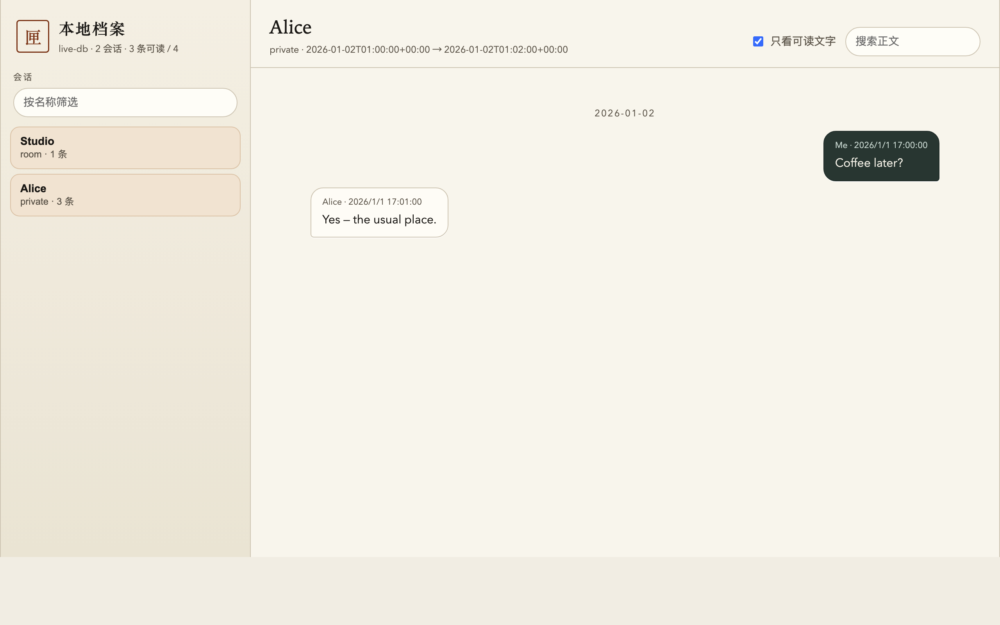
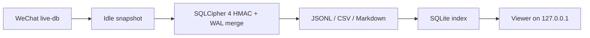

# wechat-local-archive

<p align="center">
  
</p>

<p align="center">
  <strong>Local WeChat archive for macOS.</strong><br />
  Decrypt your own live database, export structured chats, and read them in a private viewer.
</p>

<p align="center">
  
  
  
</p>



The screenshot is the **demo fixture** (`examples/demo-export`), not anyone’s real inbox. Your own archive opens the same way, with 只看可读文字 hiding image/voice XML.

## What it does

| Step | Output |
| --- | --- |
| Snapshot the idle live-db (`.db` + WAL + SHM) | A copy you can decrypt without touching WeChat |
| HMAC-verify SQLCipher 4 pages, merge WAL | Plain SQLite |
| Export | JSONL, CSV, monthly Markdown, tagged `source_kind=live-db` |
| Index + serve | Loopback viewer at `http://127.0.0.1:8765` |

It does **not** decode WeChat’s RMFH “聊天 2” backup packages. Those stay `backup2_coverage=unverified` until that format is actually solved.

## Quick start

```bash
python3 -m venv .venv
.venv/bin/pip install -e '.[dev]'
.venv/bin/python -m unittest discover -s tests -v

# Try the fictional demo
.venv/bin/python -m wechat_export index --export-dir examples/demo-export
.venv/bin/python -m wechat_export serve --export-dir examples/demo-export
```

Open [http://127.0.0.1:8765](http://127.0.0.1:8765). Leave **只看可读文字** on so image/voice XML collapses to chips.

Your own export belongs in `data/exports/<run-id>/` (gitignored). Then:

```bash
.venv/bin/python -m wechat_export index --export-dir data/exports/<run-id>
.venv/bin/python -m wechat_export serve --export-dir data/exports/<run-id>
```

See [docs/local-data.md](docs/local-data.md).

## How it fits together



Live-db success is **not** a complete backup-2 export. The two sources are labeled separately on every record.

## Privacy

- The HTTP server binds **loopback only**.
- `data/` is gitignored. Keys live in `data/private/` mode `0600`.
- Do not open-source your `data/` folder. The public tree ships a four-message demo named Alice / Studio.

## Feeding an AI

Use readable text slices, not the whole JSONL and never the key file. Details: [docs/feed-ai.md](docs/feed-ai.md).

## Agents

If you are an AI working in this repo, read [AGENTS.md](AGENTS.md) first. A second-opinion prompt for reviewers is in [docs/review-brief.md](docs/review-brief.md).

## License

[MIT](LICENSE). You may only run the decrypt path against an account you are authorized to access. This project is not affiliated with Tencent.
