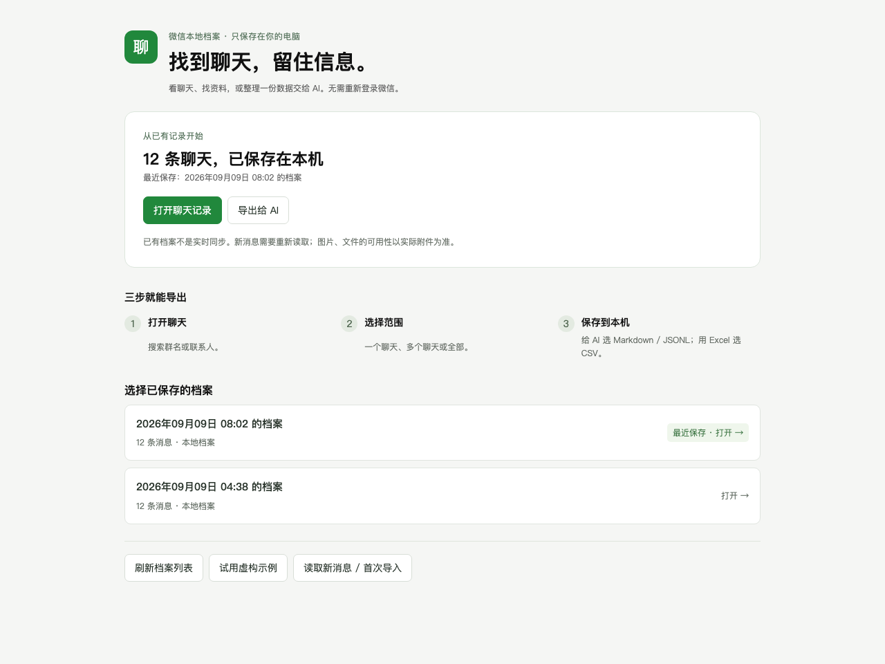

# wechat-local-archive

把授权访问的 Mac 微信本机聊天记录整理为本地档案，再按全量、群聊、私聊、
多选会话、时间和类型导出。提供微信式阅读界面，以及适合分析的
JSONL、CSV、Markdown 和离线 HTML。

**当前是 developer preview，不是已完成新用户实机验收的正式版。**
已有档案的阅读/筛选导出经过合成测试；首次读取仍受精确版本、指纹和逐阶段
授权限制。公开的已验证兼容性注册表为空，不能把单机成功当成所有用户都支持。

## 已配置好的本机入口

双击 **微信聊天档案.app**，自动打开首页，无需记端口或先开终端。点击“打开聊天记录”浏览，或“导出给 AI”选择范围。技术读取选项不再铺满首页。

[普通用户使用说明](docs/consumer-guide.md) · [本次交付与边界](docs/consumer-delivery.md) · [关键工程经验](docs/engineering-notes.md)



## 从公开代码安装（开发预览）

需要 **Python 3.11+**。先确认代码或安装包来自你信任的来源。
本工具不自动安装 Python、Homebrew、SQLCipher 或 Xcode，也不修改系统保护。

1. 解压本地预览包，或打开本仓库目录。
2. 在终端执行：
   ```sh
   zsh scripts/install-macos.command
   ```
   如果默认 `python3` 太旧，可以明确选择已有解释器：
   ```sh
   PYTHON=python3.11 zsh scripts/install-macos.command
   ```
3. 阅读安装来源和联网说明，输入 `yes` 才继续。普通安装可能由 pip 下载依赖；
   不确认就不安装、不联网。安装先写入新的独立环境，通过合成档案自检后才
   切换当前版本，失败不会覆盖旧环境。
4. 打开终端打印的 `127.0.0.1` 地址。之后启动：
   ```sh
   zsh scripts/launch-macos.command
   ```

默认安装/运行数据根是 `~/Library/Application Support/wechat-local-archive/`。
旧安装、原始快照、密钥和已有档案不会被安装器搬迁或删除。已有源码 checkout
的 `data/` 也不会被自动迁入安装版。

安装确认、离线安装、回退与日志说明见 [安装指南](docs/install-guide.md)。
预览包不是签名、公证的原生 App/DMG；不要为运行它关闭 Gatekeeper、SIP 或 AMFI。

## 第一次打开后做什么

### 先体验：打开演示档案

选择 **打开演示档案**。示例只有 **12 条虚构消息、2 个会话**（Alice / Studio），
不是开发者真实聊天。可以体验消息卡片、搜索、筛选和四种格式导出。
上方为新版首页的虚构数据示例；历史界面截图保留在 [早期演示截图](docs/images/viewer.png)。

### 已有档案：直接阅读和导出

在界面中选择已登记的本地档案。已有其他位置的完整档案，也可从可信本机 CLI 指定：

```sh
zsh scripts/launch-macos.command --export-dir /path/to/archive
```

这是本机路径，不会上传到远端。不要把密钥文件当成聊天档案。

### 从 Mac 微信首次读取：按阶段确认

1. 选择 **读取这台 Mac 的微信**，查看环境、依赖、版本/build、架构和账户候选。
2. 选择账户与保存位置，检查空间估算和权限提示。
3. 只有符合读取适配条件时，才能按当前任务确认快照、调试副本和取钥步骤。
   **未知版本不能靠“继续”绕过。** 用户按界面提示退出微信进程，不是退出登录。
4. 快照 → 候选密钥认证 → 解密/WAL 合并 → 规范化/索引 → 人工样本核对。
5. 核对成功后再导出，保存消息与范围/质量报告。

实验候选范围曾包含 **4.1.13 / build 269579、269630 / arm64**，但候选不等于已验证支持。
269631 没有自动继承旧 build 的成功结论。每个任务还需要指纹绑定和阶段授权。
详见 [兼容性与读取证据](docs/fingerprint-reader-delivery.md)。

调试副本**不是账户数据隔离**。程序不自动重签原厂微信、关闭系统保护、退出登录、
扫码或恢复覆盖。若卡在未支持环境、原生权限或人工步骤，停在明确状态，不假装成功。

## 导出范围与内容

- 全量、当前会话、指定群/私聊、多选会话；空选择不会变成全量。
- 时间区间是 **[开始, 结束)**。界面解释时区和夏令时歧义。
- 可选择消息类型或“只要可读内容”；预览同时显示同范围的候选、选中、排除数量。
- 默认 **分析版**：正文、消息卡片和来源字段，不带结构化原始载荷/媒体凭证。
- **原始版 JSONL** 保留 canonical 字段，可能含敏感结构和载荷，应显式选择。
- 图片、语音、视频、文件、引用和合并转发有类型/缺失状态；本地候选文件不等于
  已验证或已导出附件。**目前消息导出不复制附件二进制。**

每个结果保留 `manifest.json`、`coverage.json` / `coverage.md` 和附件清单。
“已识别消息表导出成功”不代表手机全部历史完整；未知表、未检查媒体和筛选排除
不能当成零。不要只拿一份 Markdown 就丢掉伴随报告。

所有 live-db 结果保留：

```text
source_kind=live-db
backup2_coverage=unverified
```

**本项目不解码 RMFH「聊天 2」备份。** 本机库成功不等于备份 2 完整导出。

## 隐私与保存位置

- HTTP 服务只监听 `127.0.0.1`，拒绝其他绑定地址；保留 Host/Origin/CSRF/CSP 检查。
- 运行时不把聊天、密钥或附件上传云端；安装阶段的依赖下载需要另行确认。
- 分析版不是匿名化：姓名和正文仍然敏感，交给外部 AI 前自行审查。
- 密钥文件为 0600、私有密钥目录为 0700。`data/` 和个人调查 Wiki 不属于公开材料。
- **不要选择云盘同步或共享文件夹**：本工具不上传，但不能阻止其他软件同步。
- 最终档案可放已选择的保存位置；快照、密钥和解密工作仍留在本机数据目录。
- 位置在创建任务时绑定。磁盘离线/被替换会阻塞，不会静默回退到其他位置。
- 真实 APFS 镜像卷跨文件系统/断开测试已通过；实体外接盘、原生选择/TCC
  仍有未验收项，详见 [保存位置验收](docs/destination-and-filter-delivery.md)。
- 当前树隐私规则通过不等于公开 Git 历史干净；历史个人元数据清理仍需 owner 审核。

更多：[本地数据](docs/local-data.md) · [给 AI 的输出](docs/feed-ai.md) ·
[附件与范围核算](docs/attachment-accounting-delivery.md)。

## 开发者与审阅者

```sh
python3 -m venv .venv
.venv/bin/pip install -e '.[dev]'
.venv/bin/python -m unittest discover -s tests -v
.venv/bin/python -m wechat_export launch --demo
```

Mac 专用测试需要对应的本机工具；普通测试只使用合成资料/自建探针，不启动真实微信。
独立安装、浏览器和镜像卷测试的适用范围要分别看待。

- [原始完整目标 T01–T06](docs/mac-guided-export-plan.md)
- [验收审计与未完成事项](docs/acceptance-audit-2026-09-09.md)
- [浏览器交互验收](docs/browser-ui-delivery.md)
- [安装器交付证据](docs/bootstrap-delivery.md)
- [审阅清单](docs/review-brief.md) · [代理规则](AGENTS.md)

CLI 与界面共享筛选语义，例如在已安装环境里运行：

```sh
python -m wechat_export slice --export-dir /path/to/archive --all --mode analysis --format jsonl --preview
python -m wechat_export slice --export-dir /path/to/archive --conversation-id confirmed-id --mode raw --format jsonl
python -m wechat_export verify --export-dir /path/to/archive
```

崩溃后的受管临时文件有租约与保留期，不会广泛删除旧文件。
[临时文件说明](docs/scratch-retention-delivery.md)解释了 dry-run、清理和不能保证安全擦除的边界。
安装版本另行保留，不属于档案临时文件清理范围。

## License

[MIT](LICENSE)。仅用于你有权访问的账户。本项目与腾讯无隶属关系。

## 当前本地交付

最新预览包：`dist/wechat-local-archive-preview-r4.zip`（本地构建，不随Git提交）。342项Python测试、独立安装浏览器与普通用户首页验收通过。详情见 [交付记录](docs/consumer-delivery.md)。

原网页链接支持确认后打开；AI分析导出保留网址。图片/文件原件尚未全部恢复，当前微信build的再次读取也未完成实机验证。不要把已有档案可用说成所有微信版本通用。
